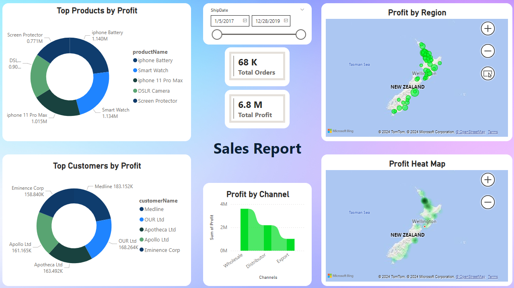

- Preprocessed Excel Data:
  1- Removed Commas and corrected date formats.
  2- converted to individual .csv files.
  3- Made SQL Data Base.
  4- Imported .csv's into that Data Base.
- Analyse using Power BI:
  1- Carefully chosed proper features or made them if absent.
  2- Chosed Apropriate visuals for simplicity and elegance.
  3- Gave it modern look.

-Modern Look

-Standard Look

